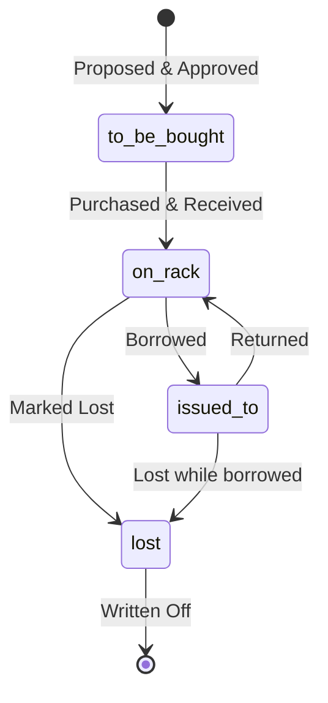
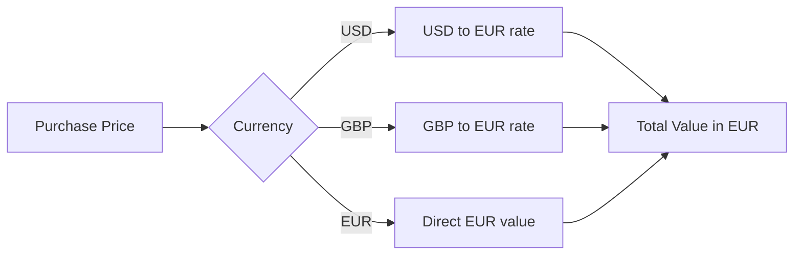
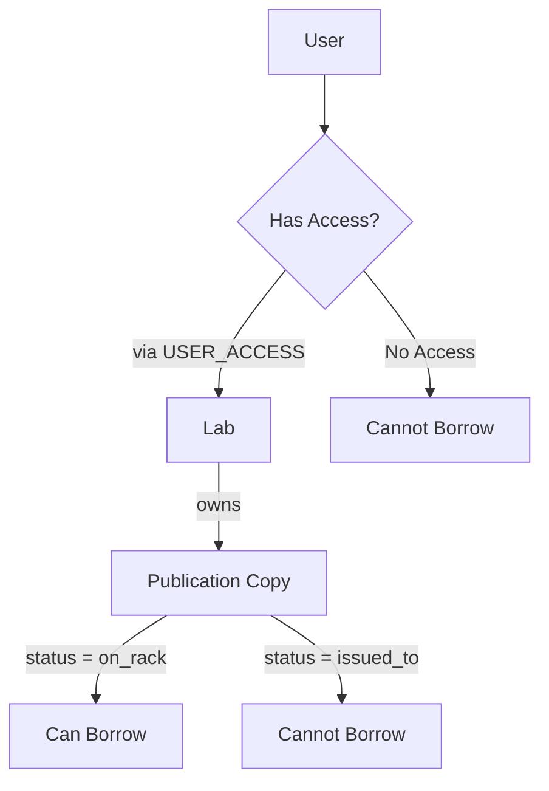

# Library Management System - Entity-Relationship Diagram

## Database Schema Overview

```mermaid
erDiagram
    PUBLISHER ||--o{ PUBLICATION : publishes
    PUBLICATION ||--o{ PUBLICATION_COPY : "has copies"
    PUBLICATION ||--o{ PUBLICATION_AUTHOR : "written by"
    PUBLICATION ||--o{ PUBLICATION_KEYWORD : "tagged with"
    PUBLICATION ||--|| REGULAR_BOOK : "is a"
    PUBLICATION ||--|| PERIODIC : "is a"
    PUBLICATION ||--|| INTERNAL_REPORT : "is a"

    REGULAR_BOOK ||--o{ BOOK_CATEGORY : "belongs to"
    CATEGORY ||--o{ BOOK_CATEGORY : "contains"

    AUTHOR ||--o{ PUBLICATION_AUTHOR : "writes"
    KEYWORD ||--o{ PUBLICATION_KEYWORD : "describes"
    KEYWORD ||--o{ USER_INTEREST : "interests"

    LAB ||--o{ PUBLICATION_COPY : owns
    LAB ||--o{ USER_ACCESS : "grants access to"

    BOOKSHOP ||--o{ PUBLICATION_COPY : "sells to"
    CURRENCY ||--o{ PUBLICATION_COPY : "prices in"

    LIBRARY_USER ||--o{ USER_ACCESS : "has access to"
    LIBRARY_USER ||--o{ USER_INTEREST : "interested in"
    LIBRARY_USER ||--o{ BORROWING : borrows
    LIBRARY_USER ||--o{ PROPOSED_PUBLICATION : proposes

    PUBLICATION_COPY ||--o{ BORROWING : "borrowed as"

    PUBLISHER {
        int id_publisher PK
        string name UK
        timestamp created_at
    }

    AUTHOR {
        int id_author PK
        string name
        string email
        timestamp created_at
    }

    LAB {
        int id_lab PK
        string name UK
        string department
        timestamp created_at
    }

    BOOKSHOP {
        int id_bookshop PK
        string name
        text address
        string phone
        timestamp created_at
    }

    CURRENCY {
        enum code PK "EUR|USD|GBP"
        decimal rate_to_euro
        timestamp last_updated
    }

    CATEGORY {
        int id_category PK
        string name UK
        text description
    }

    KEYWORD {
        int id_keyword PK
        string word UK
    }

    LIBRARY_USER {
        string email PK
        string name
        string hashed_password
        string phone
        date registration_date
        boolean active
    }

    PUBLICATION {
        int id_publication PK
        string title
        int year_publication
        enum publication_type "book|periodic|thesis|scientific_report"
        int id_publisher FK
        string edition
        timestamp created_at
    }

    REGULAR_BOOK {
        int id_publication PK_FK
        string isbn UK
    }

    PERIODIC {
        int id_publication PK_FK
        string volume_number
    }

    INTERNAL_REPORT {
        int id_publication PK_FK
        string identification_number UK
        string report_type "thesis|scientific_report"
    }

    PUBLICATION_COPY {
        int id_copy PK
        int id_publication FK
        int id_lab FK
        int id_bookshop FK
        decimal purchase_price
        enum currency "EUR|USD|GBP"
        date purchase_date
        enum status "on_rack|issued_to|lost|to_be_bought"
    }

    PUBLICATION_AUTHOR {
        int id_publication PK_FK
        int id_author PK_FK
        int author_order
    }

    BOOK_CATEGORY {
        int id_publication PK_FK
        int id_category PK_FK
    }

    PUBLICATION_KEYWORD {
        int id_publication PK_FK
        int id_keyword PK_FK
    }

    USER_ACCESS {
        string email PK_FK
        int id_lab PK_FK
        date granted_date
    }

    USER_INTEREST {
        string email PK_FK
        int id_keyword PK_FK
    }

    BORROWING {
        int id_borrowing PK
        int id_copy FK
        string email FK
        date borrow_date
        date due_date
        date return_date
    }

    PROPOSED_PUBLICATION {
        int id_proposal PK
        string email FK
        string title
        enum publication_type
        jsonb details
        date date_proposal
        string status "pending|approved|rejected|ordered"
    }
```

---

## Detailed Entity Descriptions

### Core Entities

#### 📚 PUBLICATION (Superclass)
- **Purpose**: Base entity for all publication types
- **Type**: Superclass with inheritance
- **Key Attributes**:
  - `id_publication`: Unique identifier
  - `publication_type`: Discriminator for inheritance (book/periodic/thesis/scientific_report)
  - `title`, `year_publication`, `edition`
- **Relationships**:
  - Published by one PUBLISHER
  - Written by 1-4 AUTHORS
  - Has multiple COPIES in different labs
  - Tagged with multiple KEYWORDS

#### 📖 REGULAR_BOOK (Subclass)
- **Inheritance**: Extends PUBLICATION
- **Key Attributes**: `isbn` (unique)
- **Special**: Can belong to maximum 4 CATEGORIES
- **Constraint**: Max 4 authors enforced by trigger

#### 📰 PERIODIC (Subclass)
- **Inheritance**: Extends PUBLICATION
- **Key Attributes**: `volume_number`
- **Constraint**: Max 4 authors enforced by trigger

#### 📄 INTERNAL_REPORT (Subclass)
- **Inheritance**: Extends PUBLICATION
- **Key Attributes**:
  - `identification_number` (unique)
  - `report_type`: 'thesis' or 'scientific_report'
- **Constraint**: Thesis can have ONLY 1 author (enforced by trigger)

### Supporting Entities

#### 👤 LIBRARY_USER
- **Purpose**: System users who can borrow publications
- **Identifier**: `email` (Primary Key)
- **Key Features**:
  - Can have access to multiple LABS
  - Has interest KEYWORDS for notifications
  - Can propose new publications
  - Can borrow publications

#### 🏢 LAB
- **Purpose**: Research laboratories that own publication copies
- **Key Features**:
  - Each lab owns publication copies
  - Controls user access rights
  - Only one copy of each publication per lab (enforced by UNIQUE constraint)

#### 📑 PUBLICATION_COPY
- **Purpose**: Physical copies owned by labs
- **Key Features**:
  - Links PUBLICATION to LAB (ownership)
  - Tracks purchase info (bookshop, price, currency)
  - Has status: on_rack | issued_to | lost | to_be_bought
  - Status updated automatically by triggers

#### 💰 CURRENCY
- **Purpose**: Exchange rate management
- **Supported**: EUR, USD, GBP (£, $, €)
- **Usage**: Convert all prices to EUR for accounting

### Relationship Entities

#### PUBLICATION_AUTHOR (N:M)
- Links PUBLICATION ↔ AUTHOR
- Maintains author order
- Enforces 1-4 authors constraint (1 for thesis)

#### BOOK_CATEGORY (N:M)
- Links REGULAR_BOOK ↔ CATEGORY
- Max 4 categories per book (enforced by trigger)

#### PUBLICATION_KEYWORD (N:M)
- Links PUBLICATION ↔ KEYWORD
- No limit on keywords

#### USER_ACCESS (N:M)
- Links LIBRARY_USER ↔ LAB
- Defines which labs a user can access
- Required to borrow publications

#### USER_INTEREST (N:M)
- Links LIBRARY_USER ↔ KEYWORD
- User's areas of interest for notifications

#### BORROWING
- Links LIBRARY_USER ↔ PUBLICATION_COPY
- Tracks borrow_date, due_date, return_date
- Triggers automatic status updates

#### PROPOSED_PUBLICATION
- User proposals for new publications
- Stores all publication details in JSONB
- Has workflow status: pending → approved/rejected → ordered

---

## Key Constraints & Business Rules

### Cardinality Constraints
1. **Authors**:
   - Regular books & periodics: 1 to 4 authors
   - Thesis: Exactly 1 author
   - Scientific reports: 1 to 4 authors

2. **Categories**:
   - Regular books only: 0 to 4 categories
   - Not applicable to periodics or reports

3. **Copies**:
   - Each publication can have copies in multiple labs
   - Each lab can have AT MOST ONE copy of each publication

4. **User Access**:
   - User can have access to multiple labs
   - Lab can grant access to multiple users

### Triggers & Automated Behavior

1. **check_max_authors**: Enforces 1-4 authors limit (1 for thesis)
2. **check_max_categories**: Enforces max 4 categories for books
3. **update_copy_status_on_borrow**: Auto-updates status when borrowed/returned
4. **check_user_access**: Verifies user has lab access before borrowing

### Unique Constraints
- `isbn` must be unique across all regular books
- `identification_number` must be unique for internal reports
- `(id_publication, id_lab)` must be unique in PUBLICATION_COPY

---

## Inheritance Structure

```
PUBLICATION (Superclass)
    ├── REGULAR_BOOK
    │   └── Has ISBN
    │   └── Can have Categories (max 4)
    ├── PERIODIC
    │   └── Has Volume Number
    └── INTERNAL_REPORT
        ├── THESIS (report_type = 'thesis')
        │   └── Exactly 1 author
        └── SCIENTIFIC_REPORT (report_type = 'scientific_report')
            └── 1-4 authors
```

---

## Status Flow Diagram



---

## Multi-Currency Support



---

## Access Control Model



---

*Generated for ECL Library Management System*
*Database Schema v1.0*
