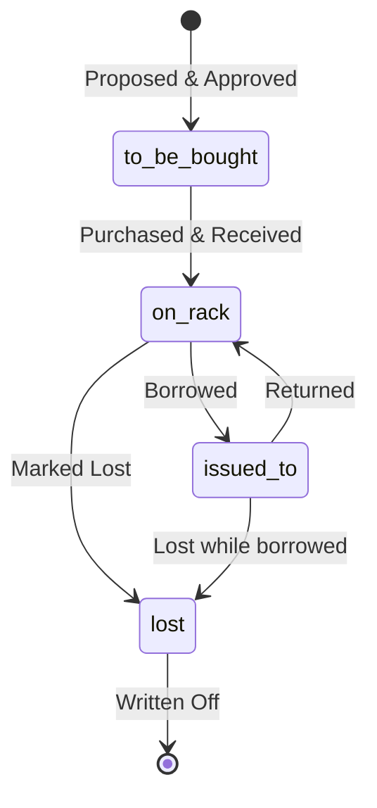
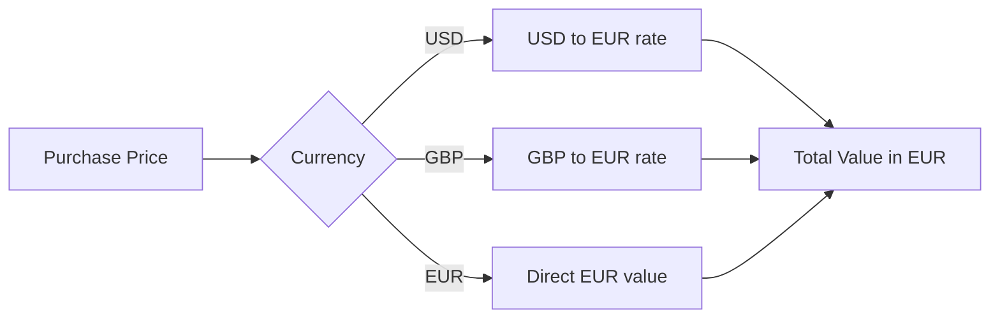
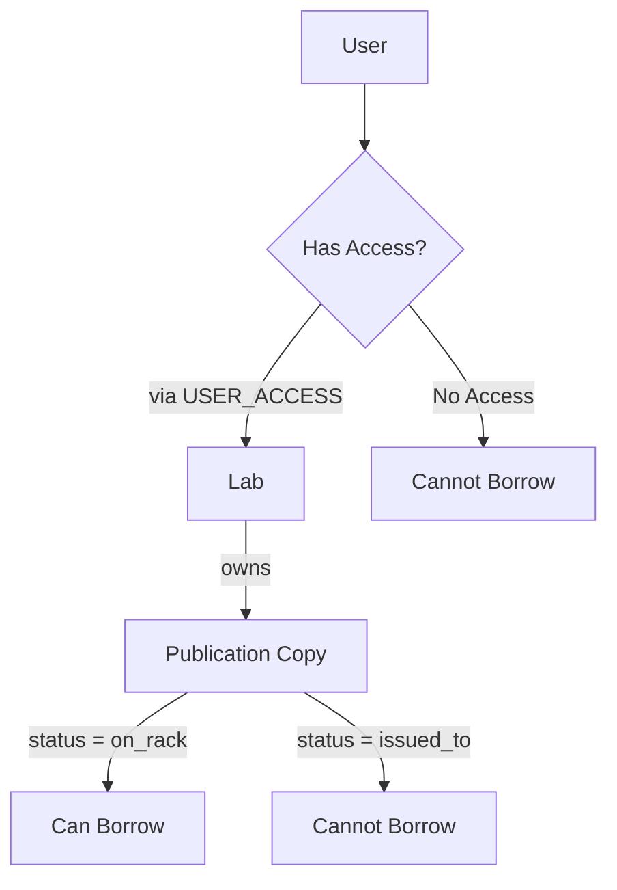

# Library Management System - Diagramme entité-associations

Comme je n'ai jamais réussi à faire macher DB_main sur Mac (j'ai même essayé de le faire tourner sur une image Docker arm...), j'ai utilisé cette solution pour construire le diagramme et l'intérgrer à mon rapport. Si vous observez ce fichier depuis la page github, vous pouvez pour déplacer à l'intérieur du diagramme pour comprendre la structure que j'ai mise en place. 

## Schéma

```mermaid
erDiagram
    PUBLISHER ||--o{ PUBLICATION : publishes
    PUBLICATION ||--o{ PUBLICATION_COPY : "has copies"
    PUBLICATION ||--o{ PUBLICATION_AUTHOR : "written by"
    PUBLICATION ||--o{ PUBLICATION_KEYWORD : "tagged with"
    PUBLICATION ||--|| REGULAR_BOOK : "is a"
    PUBLICATION ||--|| PERIODIC : "is a"
    PUBLICATION ||--|| INTERNAL_REPORT : "is a"

    REGULAR_BOOK ||--o{ BOOK_CATEGORY : "belongs to"
    CATEGORY ||--o{ BOOK_CATEGORY : "contains"

    AUTHOR ||--o{ PUBLICATION_AUTHOR : "writes"
    KEYWORD ||--o{ PUBLICATION_KEYWORD : "describes"
    KEYWORD ||--o{ USER_INTEREST : "interests"

    LAB ||--o{ PUBLICATION_COPY : owns
    LAB ||--o{ USER_ACCESS : "grants access to"

    BOOKSHOP ||--o{ PUBLICATION_COPY : "sells to"
    CURRENCY ||--o{ PUBLICATION_COPY : "prices in"

    LIBRARY_USER ||--o{ USER_ACCESS : "has access to"
    LIBRARY_USER ||--o{ USER_INTEREST : "interested in"
    LIBRARY_USER ||--o{ BORROWING : borrows
    LIBRARY_USER ||--o{ PROPOSED_PUBLICATION : proposes

    PUBLICATION_COPY ||--o{ BORROWING : "borrowed as"

    PUBLISHER {
        int id_publisher PK
        string name "UNIQUE"
        timestamp created_at
    }

    AUTHOR {
        int id_author PK
        string name
        string email
        timestamp created_at
    }

    LAB {
        int id_lab PK
        string name "UNIQUE"
        string department
        timestamp created_at
    }

    BOOKSHOP {
        int id_bookshop PK
        string name
        text address
        string phone
        timestamp created_at
    }

    CURRENCY {
        string code PK "EUR_USD_GBP"
        decimal rate_to_euro
        timestamp last_updated
    }

    CATEGORY {
        int id_category PK
        string name "UNIQUE"
        text description
    }

    KEYWORD {
        int id_keyword PK
        string word "UNIQUE"
    }

    LIBRARY_USER {
        string email PK
        string name
        string hashed_password
        string phone
        date registration_date
        boolean active
    }

    PUBLICATION {
        int id_publication PK
        string title
        int year_publication
        string publication_type "book_periodic_thesis_report"
        int id_publisher FK
        string edition
        timestamp created_at
    }

    REGULAR_BOOK {
        int id_publication "PK, FK"
        string isbn "UNIQUE"
    }

    PERIODIC {
        int id_publication "PK, FK"
        string volume_number
    }

    INTERNAL_REPORT {
        int id_publication "PK, FK"
        string identification_number "UNIQUE"
        string report_type "thesis_or_scientific_report"
    }

    PUBLICATION_COPY {
        int id_copy PK
        int id_publication FK
        int id_lab FK
        int id_bookshop FK
        decimal purchase_price
        string currency "EUR_USD_GBP"
        date purchase_date
        string status "on_rack_issued_to_lost_to_be_bought"
    }

    PUBLICATION_AUTHOR {
        int id_publication "PK, FK"
        int id_author "PK, FK"
        int author_order
    }

    BOOK_CATEGORY {
        int id_publication "PK, FK"
        int id_category "PK, FK"
    }

    PUBLICATION_KEYWORD {
        int id_publication "PK, FK"
        int id_keyword "PK, FK"
    }

    USER_ACCESS {
        string email "PK, FK"
        int id_lab "PK, FK"
        date granted_date
    }

    USER_INTEREST {
        string email "PK, FK"
        int id_keyword "PK, FK"
    }

    BORROWING {
        int id_borrowing PK
        int id_copy FK
        string email FK
        date borrow_date
        date due_date
        date return_date
    }

    PROPOSED_PUBLICATION {
        int id_proposal PK
        string email FK
        string title
        string publication_type
        jsonb details
        date date_proposal
        string status "pending_approved_rejected_ordered"
    }
```



## Structure

```
PUBLICATION (Superclass)
    ├── REGULAR_BOOK
    │   └── Has ISBN
    │   └── Can have Categories (max 4)
    ├── PERIODIC
    │   └── Has Volume Number
    └── INTERNAL_REPORT
        ├── THESIS (report_type = 'thesis')
        │   └── Exactly 1 author
        └── SCIENTIFIC_REPORT (report_type = 'scientific_report')
            └── 1-4 authors
```

---

## Diagramme pour le status des publications



---

## Différentes currencies



---

## Contrôle d'accès


